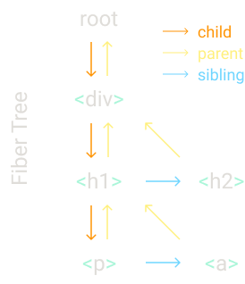
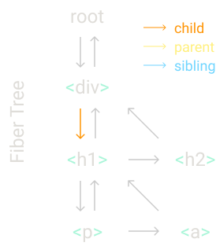
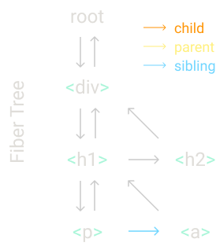

import { CodeWave } from "gatsby-theme-waves"
import ImageWave from "../../src/components/image-wave"

We are going to rewrite React from scratch. Step by step. Following the architecture from the real React code but without all the optimizations and non-essential features.

If you've read any of [my previous "build your own React" posts](https://engineering.hexacta.com/didact-learning-how-react-works-by-building-it-from-scratch-51007984e5c5), the difference is that this post is based on React 16.8, so we can now use hooks and drop all the code related to classes.

You can find the history with the old blog posts and the code on the [Didact repo](https://github.com/pomber/didact). There's also a [talk covering the same content](https://youtu.be/8Kc2REHdwnQ). But this is a self-contained post. 

Starting from scratch, these are all the things we'll add to our version of React one by one:

- **Step I**: The `createElement` Function
- **Step II**: The `render` Function
- **Step III**: Concurrent Mode
- **Step IV**: Fibers
- **Step V**: Render and Commit Phases
- **Step VI**: Reconciliation
- **Step VII**: Function Components
- **Step VIII**: Hooks

<CodeWave>

```jsx
const element = <h1 title="foo">Hello</h1>
const container = document.getElementById("root")
ReactDOM.render(element, container)
```

### Step Zero: Review

But first let's review some basic concepts. You can skip this step if you already have a good idea of how React, JSX and DOM elements work.

We'll use this React app, just three lines of code. The first one defines a React element. The next one gets a node from the DOM. The last one renders the React element into the container.

**Let's remove all the React specific code and replace it with vanilla JavaScript**.

```jsx 1
const element = <h1 title="foo">Hello</h1>
const container = document.getElementById("root")
ReactDOM.render(element, container)
```

On the first line we have the element, defined with JSX. It isn't even valid JavaScript, so in order to replace it with vanilla JS, first we need to replace it with valid JS.

JSX is transformed to JS by build tools like Babel. The transformation is usually simple: replace the code inside the tags with a call to `createElement`, passing the tag name, the props and the children as parameters.

```jsx
const element = React.createElement(
  "h1",
  { title: "foo" },
  "Hello"
)

const container = document.getElementById("root")
ReactDOM.render(element, container)
```

`React.createElement` creates an object from its arguments. Besides some validations, that's all it does. So we can safely replace the function call with its output.

```jsx
const element = {
  type: "h1",
  props: {
    title: "foo",
    children: "Hello",
  },
}

const container = document.getElementById("root")
ReactDOM.render(element, container)
```

And this is what an element is, an object with two properties: `type` and `props` (well, [it has more](https://github.com/facebook/react/blob/f4cc45ce962adc9f307690e1d5cfa28a288418eb/packages/react/src/ReactElement.js#L111), but we only care about these two).

The `type` is a string that specifies the type of the DOM node we want to create, it's the `tagName` you pass to `document.createElement` when you want to create an HTML element. It can also be a function, but we'll leave that for Step VII.

`props` is another object, it has all the keys and values from the JSX attributes. It also has a special property: `children`.

`children` in this case is a string, but it's usually an array with more elements. That's why elements are also trees.

```jsx 10
const element = {
  type: "h1",
  props: {
    title: "foo",
    children: "Hello",
  },
}

const container = document.getElementById("root")
ReactDOM.render(element, container)
```

The other piece of React code we need to replace is the call to `ReactDOM.render`.

`render` is where React changes the DOM, so let's do the updates ourselves.

```jsx 1,2,4,7,11,12
const element = {
  type: "h1",
  props: {
    title: "foo",
    children: "Hello",
  },
}

const container = document.getElementById("root")

const node = document.createElement(element.type)
node["title"] = element.props.title

const text = document.createTextNode("")
text["nodeValue"] = element.props.children

node.appendChild(text)
container.appendChild(node)
```

First we create a node\* using the element `type`, in this case `h1`.

Then we assign all the element `props` to that node. Here it's just the title.

_\* To avoid confusion, I'll use "element" to refer to React elements and "node" for DOM elements._

```js 1,5,7,14,15
const element = {
  type: "h1",
  props: {
    title: "foo",
    children: "Hello",
  },
}

const container = document.getElementById("root")

const node = document.createElement(element.type)
node["title"] = element.props.title

const text = document.createTextNode("")
text["nodeValue"] = element.props.children

node.appendChild(text)
container.appendChild(node)
```

Then we create the nodes for the children. We only have a string as a child so we create a text node.

Using `textNode` instead of setting `innerText` will allow us to treat all elements in the same way later. Note also how we set the `nodeValue` like we did it with the `h1` title, it's almost as if the string had `props: {nodeValue: "hello"}`.

```js 9,17,18
const element = {
  type: "h1",
  props: {
    title: "foo",
    children: "Hello",
  },
}

const container = document.getElementById("root")

const node = document.createElement(element.type)
node["title"] = element.props.title

const text = document.createTextNode("")
text["nodeValue"] = element.props.children

node.appendChild(text)
container.appendChild(node)
```

Finally, we append the `textNode` to the `h1` and the `h1` to the `container`.

```js 1:18
const element = {
  type: "h1",
  props: {
    title: "foo",
    children: "Hello",
  },
}

const container = document.getElementById("root")

const node = document.createElement(element.type)
node["title"] = element.props.title

const text = document.createTextNode("")
text["nodeValue"] = element.props.children

node.appendChild(text)
container.appendChild(node)
```

And now we have the same app as before, but without using React.

</CodeWave>

<CodeWave>

```jsx file=./00.jsx
```

### Step I: The `createElement` Function

Let's start again with another app. This time we'll replace React code with our own version of React.

We'll start by writing our own `createElement`.

Let's transform the JSX to JS so we can see the `createElement` calls.

```jsx file=./01.jsx
```

As we saw in the previous step, an element is an object with `type` and `props`. The only thing that our function needs to do is create that object.

```jsx file=./02.jsx
```

We use the _spread operator_ for the `props` and the _rest parameter syntax_ for the `children`, this way the `children` prop will always be an array.

<div>

For example, `createElement("div")` returns:

```json
{
  "type": "div",
  "props": { "children": [] }
}
```

`createElement("div", null, a)` returns:

```json
{
  "type": "div",
  "props": { "children": [a] }
}
```

and `createElement("div", null, a, b)` returns:

```json
{
  "type": "div",
  "props": { "children": [a, b] }
}
```

</div>

```jsx file=./03.jsx
```

The `children` array could also contain primitive values like strings or numbers. So we'll wrap everything that isn't an object inside its own element and create a special type for them: `TEXT_ELEMENT`.

_React doesn't wrap primitive values or create empty arrays when there aren't `children`, but we do it because it will simplify our code, and for our library we prefer simple code than performant code._

```jsx file=./03.jsx  25,28,29,30
```

We are still using React's `createElement`.

In order to replace it, let's give a name to our library. We need a name that sounds like React but also hints its _didactic_ purpose.

```jsx file=./04.jsx
```

We'll call it Didact.

But we still want to use JSX here. How do we tell babel to use Didact's `createElement` instead of React's?

```jsx file=./05.jsx
```

If we have a comment like this one, when babel transpiles the JSX it will use the function we define.

```jsx file=./05.jsx 37
```

### Step II: The `render` Function

Next, we need to write our version of the `ReactDOM.render` function.

```jsx file=./06.jsx 25:27,29,31,32,42
```

For now, we only care about adding stuff to the DOM. We'll handle updating and deleting later.

```jsx file=./07.jsx 25:29
```

We start by creating the DOM node using the element type, and then append the new node to the container.

```jsx file=./08.jsx 25,28:30,33
```

We recursively do the same for each child.

```jsx file=./09.jsx
```

We also need to handle text elements, if the element type is `TEXT_ELEMENT` we create a text node instead of a regular node.

```jsx file=./10.jsx
```

The last thing we need to do here is assign the element props to the node.

```jsx file=./10.jsx 1:58
```

And that's it. We now have a library that can render JSX to the DOM.

Give it a try on [codesandbox](https://codesandbox.io/s/didact-2-k6rbj).

</CodeWave>

### Step III: Concurrent Mode

But... before we start adding more code we need a refactor.

<CodeWave>

```jsx file=./10.jsx 25,38:40,43
```

There's a problem with this recursive call.

Once we start rendering, we won't stop until we have rendered the complete element tree.
If the element tree is big, it may block the main thread for too long. And if the browser needs to do high priority stuff like handling user input or keeping an animation smooth, it will have to wait until the render finishes.

```jsx file=./11.jsx
```

So we are going to break the work into small units, and after we finish each unit we'll let the browser interrupt the rendering if there's anything else that needs to be done.

```jsx file=./11.jsx 47,55,56,58
```

We use `requestIdleCallback` to make a loop. You can think of `requestIdleCallback` as a `setTimeout`, but instead of us telling it when to run, the browser will run the callback when the main thread is idle.

_React [doesn't use `requestIdleCallback` anymore](https://github.com/facebook/react/issues/11171#issuecomment-417349573). Now it uses the [scheduler package](https://github.com/facebook/react/tree/master/packages/scheduler). But for this use case it's conceptually the same._


```jsx file=./11.jsx 47,48,49,53,54,56
```

`requestIdleCallback` also gives us a deadline parameter. We can use it to check how much time we have until the browser needs to take control again.

<div>	

_As of November 2019, Concurrent Mode isn't stable in React yet. The stable version of the loop looks more like this:_	

```js	
while (nextUnitOfWork) {	
  nextUnitOfWork = performUnitOfWork(	
    nextUnitOfWork	
  )	
}	
```	

</div>

```jsx file=./11.jsx 45,47,50:52,56,60:62
```

To start using the loop we'll need to set the first unit of work, and then write a `performUnitOfWork` function that not only performs the work but also returns the next unit of work.

</CodeWave>

### Step IV: Fibers

To organize the units of work we'll need a data structure: a fiber tree.

We'll have one fiber for each element and each fiber will be a unit of work.

Let me show you with an example.

<ImageWave>


Suppose we want to render an element tree like this one:

```jsx
Didact.render(
  <div>
    <h1>
      <p />
      <a />
    </h1>
    <h2 />
  </div>,
  container
)
```

In the `render` we'll create the root fiber and set it as the `nextUnitOfWork`. The rest of the work will happen on the `performUnitOfWork` function, there we will do three things for each fiber:

1. add the element to the DOM
2. create the fibers for the element's children
3. select the next unit of work



One of the goals of this data structure is to make it easy to find the next unit of work. That's why each fiber has a link to its first child, its next sibling and its parent.



When we finish performing work on a fiber, if it has a `child` that fiber will be the next unit of work.

From our example, when we finish working on the `div` fiber the next unit of work will be the `h1` fiber.



If the fiber doesn't have a `child`, we use the `sibling` as the next unit of work.

For example, the `p` fiber doesn't have a `child` so we move to the `a` fiber after finishing it.


And if the fiber doesn't have a `child` nor a `sibling` we go to the "uncle": the `sibling` of the `parent`. Like `a` and `h2` fibers from the example.

Also, if the `parent` doesn't have a `sibling`, we keep going up through the `parent`s until we find one with a `sibling` or until we reach the root. If we have reached the root, it means we have finished performing all the work for this `render`.

</ImageWave>

Now let's put it into code.

<CodeWave>

```jsx file=./11.jsx 25:45
```

First, let's remove this code from the `render` function.

```jsx file=./12.jsx 25,39,41:45
```

We keep the part that creates a DOM node in its own function, we are going to use it later.

```jsx file=./13.jsx 41:50
```

In the `render` function we set `nextUnitOfWork` to the root of the fiber tree.

```jsx file=./13.jsx 52,55:57,61,65:69
```

Then, when the browser is ready,it will call our `workLoop` and we'll start working on the root.

```jsx file=./14.jsx
```

First, we create a new node and append it to the DOM.

We keep track of the DOM node in the `fiber.dom` property. 

```jsx file=./15.jsx
```

Then for each child we create a new fiber.

```jsx file=./16.jsx
```

And we add it to the fiber tree setting it either as a child or as a sibling, depending on whether it's the first child or not.

```jsx file=./17.jsx
```

Finally we search for the next unit of work.
We first try with the child, then with the sibling, then with the uncle, and so on.

```jsx file=./17.jsx 65:108
```

And that's our `performUnitOfWork`.

```jsx file=./17.jsx 65,70:72
```

### Step V: Render and Commit Phases

We have another problem here.

We are adding a new node to the DOM each time we work on an element.
And, remember, the browser could interrupt our work before we finish rendering the whole tree.
In that case, the user will see an incomplete UI. And we don't want that.

```jsx file=./18.jsx 65,72[1]
```

So we need to remove the part that mutates the DOM from here.

```jsx file=./18.1.jsx
```

Instead, we'll keep track of the root of the fiber tree. We call it the work in progress root or `wipRoot`.

```jsx file=./19.jsx 41:43,58,67:69,72
```

And once we finish all the work (we know it because there isn't a next unit of work) we commit the whole fiber tree to the DOM.

```jsx file=./20.jsx 41:54
```

We do it in the `commitRoot` function. Here we recursively append all the nodes to the dom.

### Step VI: Reconciliation

So far we only _added_ stuff to the DOM, but what about updating or deleting nodes?

That's what we are going to do now, we need to compare the elements we receive on the `render` function to the last fiber tree we committed to the DOM.

```jsx file=./21.jsx 41,43,45,57,58,63,64,66,69
```

So we need to save a reference to that "last fiber tree we committed to the DOM" after we finish the commit. We call it `currentRoot`.

We also add the `alternate` property to every fiber. This property is a link to the old fiber, the fiber that we committed to the DOM in the previous commit phase.

```jsx file=./21.jsx 90:129
```

Now let's extract the code from `performUnitOfWork` that creates the new fibers...

```jsx file=./22.jsx 90,95,96,108,110,114[1]
```

...to a new `reconcileChildren` function.

```jsx file=./22.jsx 110,133
```

Here we will reconcile the old fibers with the new elements.

```jsx file=./23.jsx 110:113,116:120,123
```

We iterate at the same time over the children of the old fiber (`wipFiber.alternate`) and the array of elements we want to reconcile.

If we ignore all the boilerplate needed to iterate over an array and a linked list at the same time, we are left with what matters most inside this while: `oldFiber` and `element`. **The `element` is the thing we want to render to the DOM and the `oldFiber` is what we rendered the last time.**

We need to compare them to see if there's any change we need to apply to the DOM.

```jsx file=./24.jsx
```

To compare them we use the type:

- if the old fiber and the new element have the same type, we can keep the DOM node and just update it with the new props

- if the type is different and there is a new element, it means we need to create a new DOM node

- and if the types are different and there is an old fiber, we need to remove the old node

_Here React also uses keys, that makes a better reconciliation. For example, it detects when children change places in the element array._

```jsx file=./25.jsx 123:137
```

When the old fiber and the element have the same type, we create a new fiber keeping the DOM node from the old fiber and the props from the element.

We also add a new property to the fiber: the `effectTag`. We'll use this property later, during the commit phase.

```jsx file=./26.jsx 138:147
```

Then for the case where the element needs a new DOM node we tag the new fiber with the `PLACEMENT` effect tag.

```jsx file=./27.jsx 148:151
```

And for the case where we need to delete the node, we don't have a new fiber so we add the effect tag to the old fiber.

But when we commit the fiber tree to the DOM we do it from the work in progress root, which doesn't have the old fibers.

```jsx file=./28.jsx 57,65,67,72
```

So we need an array to keep track of the nodes we want to remove.


```jsx file=./29.jsx 41,42,46
```

And then, when we are commiting the changes to the DOM, we also use the fibers from that array.


```jsx file=./29.jsx 48:56
```

Now, let's change the `commitWork` function to handle the new `effectTags`.

```jsx file=./30.jsx
```

If the fiber has a `PLACEMENT` effect tag we do the same as before, append the DOM node to the node from the parent fiber.

```jsx file=./31.jsx
```

If it's a `DELETION`, we do the opposite, remove the child.

```jsx file=./32.jsx
```

And if it's an `UPDATE`, we need to update the existing DOM node with the props that changed.

```jsx file=./33.jsx
```

We'll do it in this `updateDom` function.

```jsx file=./34.jsx 36:56
```

We compare the props from the old fiber to the props of the new fiber, remove the props that are gone, and set the props that are new or changed.

```jsx file=./35.jsx
```

One special kind of prop that we need to update are event listeners, so if the prop name starts with the "on" prefix we'll handle them differently.

```jsx file=./36.jsx
```

If the event handler changed we remove it from the node.

```jsx file=./37.jsx
```

And then we add the new handler.

</CodeWave>

Try the version with reconciliation on [codesandbox](https://codesandbox.io/s/didact-6-96533).

<CodeWave>

```jsx file=./38.jsx 245:251
```

### Step VII: Function Components

The next thing we need to add is support for function components.

First let's change the example. We'll use this simple function component, that returns an `h1` element.

Note that if we transform the jsx to js, it will be:

<div>

```js
function App(props) {
  return Didact.createElement(
    "h1",
    null,
    "Hi ",
    props.name
  )
}
const element = Didact.createElement(App, {
  name: "foo",
})
```

</div>

```jsx file=./38.jsx 162:168
```

Function components are differents in two ways:

- the fiber from a function component doesn't have a DOM node
- and the children come from running the function instead of getting them directly from the `props`

```jsx file=./41.jsx
```

We check if the fiber type is a function, and depending on that we go to a different update function.

In `updateHostComponent` we do the same as before.

```jsx file=./42.jsx
```

And in `updateFunctionComponent` we run the function to get the children.

For our example, here the `fiber.type` is the `App` function and when we run it, it returns the `h1` element.

Then, once we have the children, the reconciliation works in the same way, we don't need to change anything there.

```jsx file=./42.jsx 99:125
```

What we need to change is the `commitWork` function.

Now that we have fibers without DOM nodes we need to change two things.

```jsx file=./43.jsx 104:108,114
```

First, to find the parent of a DOM node we'll need to go up the fiber tree until we find a fiber with a DOM node.

```jsx file=./44.jsx
```

And when removing a node we also need to keep going until we find a child with a DOM node.

```jsx file=./44.jsx 270:276
```

### Step VIII: Hooks

Last step. Now that we have function components let's also add state.

```jsx file=./45.jsx
```

Let's change our example to the classic counter component. Each time we click it, it increments the state by one.

Note that we are using `Didact.useState` to get and update the counter value.

```jsx file=./46.jsx 195,196,198:202
```

Here is where we call the `Counter` function from the example. And inside that function we call `useState`.

```jsx file=./47.jsx 195:201,202[21:43],204
```

We need to initialize some global variables before calling the function component so we can use them inside of the `useState` function.

First we set the work in progress fiber.

We also add a `hooks` array to the fiber to support calling `useState` several times in the same component. And we keep track of the current hook index.

```jsx file=./48.jsx 206:218
```

When the function component calls `useState`, we check if we have an old hook. We check in the `alternate` of the fiber using the hook index.

If we have an old hook, we copy the state from the old hook to the new hook,
if we don't we initialize the state.

Then we add the new hook to the fiber, increment the hook index by one, and return the state.

```jsx file=./49.jsx 211,213:225,229
```

`useState` should also return a function to update the state, so we define a `setState` function that receives an action (for the `Counter` example this action is the function that increments the state by one).

We push that action to a queue we added to the hook.

And then we do something similar to what we did in the `render` function, set a new work in progress root as the next unit of work so the work loop can start a new render phase.

```jsx file=./50.jsx
```

But we haven't run the action yet.

We do it the next time we are rendering the component, we get all the actions from the old hook queue, and then apply them one by one to the new hook state, so when we return the state it's updated.

```jsx file=./50.jsx 1:319
```

And that's all. We've built our own version of React.

You can play with it on [codesandbox](https://codesandbox.io/s/didact-8-21ost) or [github](https://github.com/pomber/didact).

</CodeWave>

### Epilogue

Besides helping you understand how React works, one of the goals of this post is to make it easier for you to dive deeper in the React codebase. That's why we used the same variable and function names almost everywhere.

For example, if you add a breakpoint in one of your function components in a real React app, the call stack should show you:

- `workLoop`
- `performUnitOfWork`
- `updateFunctionComponent`

We didn't include a lot of React features and optimizations. For example, these are a few things that React does differently:

- In Didact, we are walking the whole tree during the render phase. React instead follows some hints and heuristics to skip entire sub-trees where nothing changed.
- We are also walking the whole tree in the commit phase. React keeps a linked list with just the fibers that have effects and only visit those fibers.
- Every time we build a new work in progress tree, we create new objects for each fiber. React recycles the fibers from the previous trees.
- When Didact receives a new update during the render phase, it throws away the work in progress tree and starts again from the root. React tags each update with an expiration timestamp and uses it to decide which update has a higher priority.
- And many more...

There are also a few features that you can add easily:

- use an object for the style prop
- [flatten children arrays](https://github.com/pomber/didact/issues/11)
- useEffect hook
- reconciliation by key

If you add any of these or other features to Didact send a pull request to the [GitHub repo](https://github.com/pomber/didact), so others can see it.

Thanks for reading!

And if you want to comment, like or share this post you can use this tweet:

https://twitter.com/pomber/status/1194616086941126656
